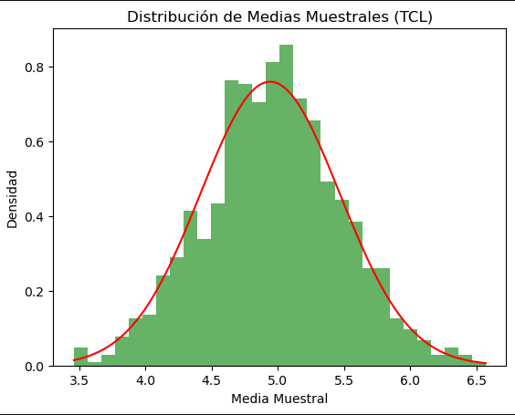

# Capítulo 6: Técnicas de Muestreo y el Teorema Central del Límite

**6.1. Conceptos de Muestreo**

El muestreo es la técnica utilizada para seleccionar una parte de la población con el fin de hacer inferencias sobre la población completa.

* **Distribución de Muestreo de la Media**: La distribución de las medias de todas las posibles muestras de un tamaño dado extraídas de una población.
* **Distribución de Muestreo de Proporciones**: Similar a la distribución de muestreo de la media, pero para proporciones en lugar de medias.

**6.2. El Teorema Central del Límite**

El Teorema Central del Límite (TCL) establece que, para una muestra suficientemente grande, la distribución de la media muestral se aproxima a una distribución normal, independientemente de la distribución de la población original.

* **Importancia**: El TCL es fundamental en la inferencia estadística porque permite el uso de la distribución normal para hacer inferencias sobre la media de una población a partir de muestras.

**6.3. Ejemplo en Python: Simulación del Teorema Central del Límite**

**Objetivo**: Demostrar el Teorema Central del Límite mediante la simulación de medias muestrales de una población no normal.

```python
import numpy as np
import matplotlib.pyplot as plt

# Simulando una población con una distribución no normal (uniforme)
np.random.seed(42)
poblacion = np.random.uniform(0, 10, 10000)

# Calculando las medias de múltiples muestras
medias_muestrales = []
for _ in range(1000):
    muestra = np.random.choice(poblacion, size=30)
    medias_muestrales.append(np.mean(muestra))

# Visualizando la distribución de las medias muestrales
plt.hist(medias_muestrales, bins=30, density=True, alpha=0.6, color='g')

# Comparando con la distribución normal
media_poblacion = np.mean(poblacion)
desviacion_poblacion = np.std(poblacion) / np.sqrt(30)
x = np.linspace(min(medias_muestrales), max(medias_muestrales), 100)
plt.plot(x, stats.norm.pdf(x, media_poblacion, desviacion_poblacion), color='red')
plt.title('Distribución de Medias Muestrales (TCL)')
plt.xlabel('Media Muestral')
plt.ylabel('Densidad')
plt.show()

```

<figure><figcaption></figcaption></figure>

**Explicación**:

* Se simula una población con una distribución uniforme (no normal).
* Se calculan las medias de 1,000 muestras y se visualiza la distribución de estas medias muestrales.
* Se observa cómo la distribución de las medias muestrales tiende a una forma normal, en línea con el Teorema Central del Límite.

***
